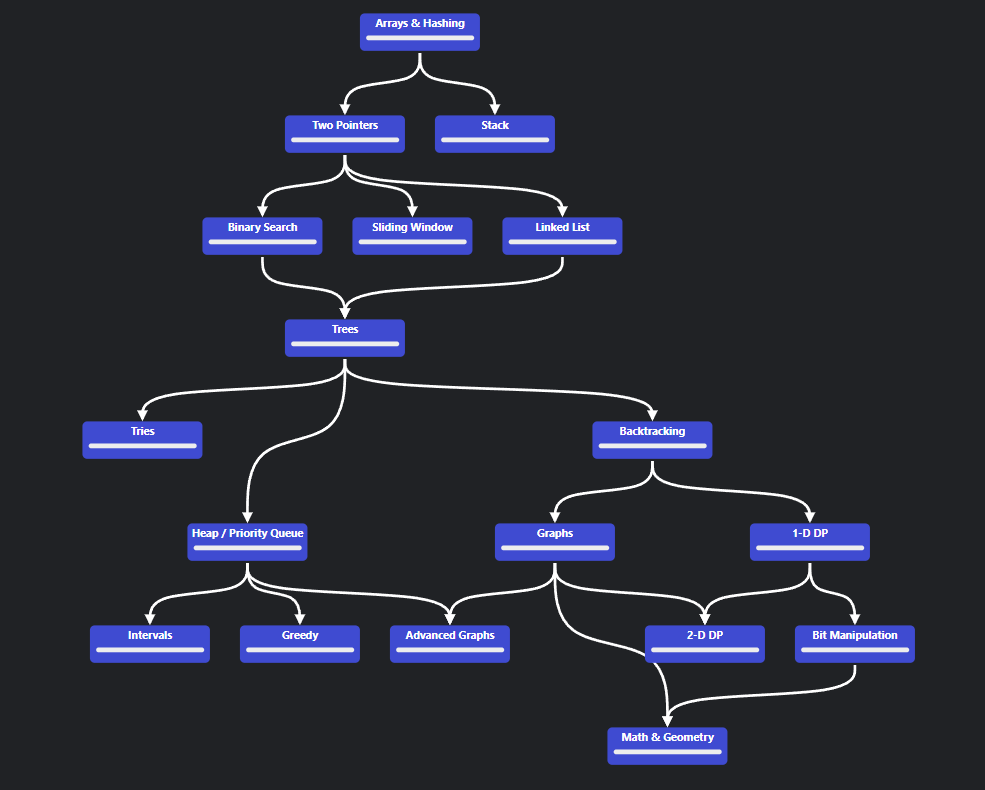

# [LEETCODE](https://leetcode.com/)

## Table of Contents

- arrays&hashing
  - easy
    - [contains_duplicates](arrays&hashing/easy/contains_duplicates.ipynb)
    - [two_sum](arrays&hashing/easy/two_sum.ipynb)
    - [valid_anagram](arrays&hashing/easy/valid_anagram.ipynb)
  - medium
    - [group-anagrams](arrays&hashing/medium/group-anagrams.ipynb)
    - [top-k-frequent-elements](arrays&hashing/medium/top-k-frequent-elements.ipynb)
    - [string-encode-and-decode](arrays&hashing/medium/string-encode-and-decode.ipynb)
    - [product-of-arr-except-self](arrays&hashing/medium/product-of-arr-except-self.ipynb)
    - [valid-sudoku](arrays&hashing/medium/valid-sudoku.ipynb)
    - [longest-consecutive-sequence](arrays&hashing/medium/longest-consecutive-sequence.ipynb)
- 2_pointers
  - easy
    - [valid_palindrome](2_pointers/easy/valid_palindrome.ipynb)
- stack
  - easy
    - [valid_parentheses](stack/easy/valid_parentheses.ipynb)
- binary_search
  - easy
    - [binary_search](binary_search/easy/binary_search.ipynb)

## [Roadmap](https://neetcode.io/roadmap)

